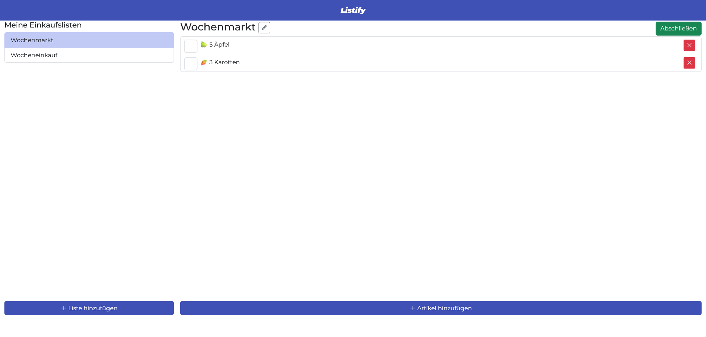
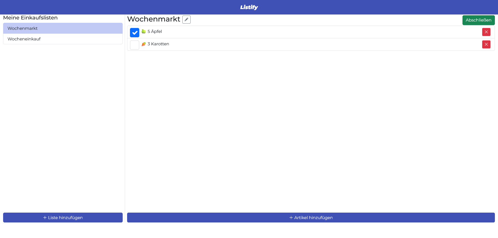
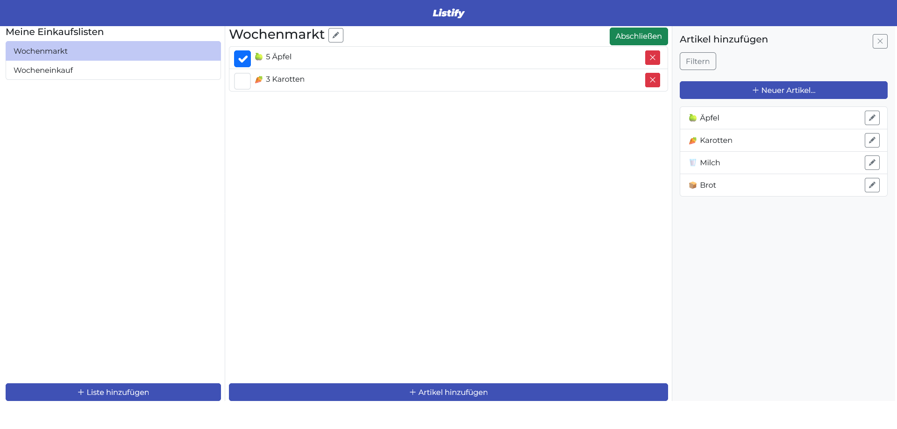
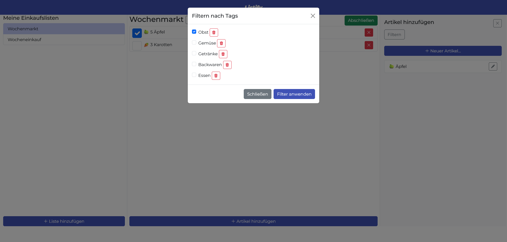
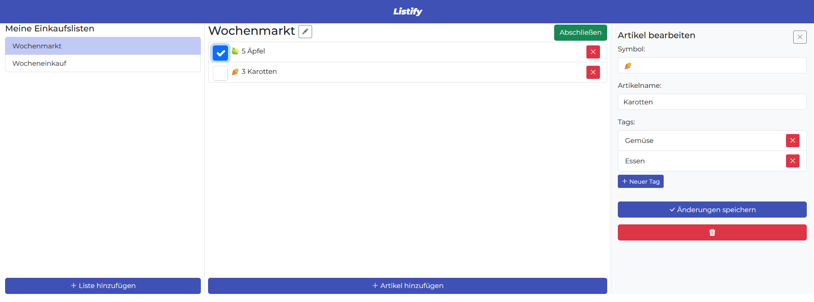

# Listify – Shopping List Web Application

Listify is a web application for managing shopping lists. Users can create and edit shopping lists, add items, filter items by tags and mark items as bought while shopping.

The project was developed as part of the course 'Web Engineering' during my Bachelor’s degree in Communication, Knowledge & Media at University of Applied Sciences Upper Austria, Campus Hagenberg.

The goal of the project was to design and implement a shopping list application from concept and wireframes to a functional frontend implementation using HTML, CSS and JavaScript.

## About the Project

Listify helps users organize different shopping lists, such as supermarket or weekly shopping lists. Items can be added to lists, marked as bought and removed again if needed.

The application also includes item and tag management. Existing items can be filtered by tags, and new items or tags can be created. Initial data is loaded from JSON files.

The project demonstrates the implementation of a structured frontend application with object-oriented JavaScript, modular code and an MVC-based architecture.

## Features

- Create and edit shopping lists
- Mark shopping lists as completed
- Add and remove items to shopping lists
- Mark items as bought
- Filter items by tags
- Create and edit items and their tags
- Load initial data from JSON files

## Tech Stack

### Frontend

- HTML
- CSS
- JavaScript
- Bootstrap

### Architecture and Data

- Object-oriented JavaScript
- MVC-based structure
- Modular JavaScript files
- JSON files for initial data

### Design and Prototyping

- Wireframes
- Responsive design
- CSS animations
- Google Fonts

## Repository Structure

```text
index.html          Main entry point of the application

css/                Stylesheets and custom CSS

js/                 JavaScript files for model, view, controller,
                    data handling and application logic

json/               Initial data for shopping lists, items, tags and users
```

## Architecture

The application follows an MVC-based structure:

- **Model**: Manages the application data, such as users, shopping lists, items and tags.
- **View**: Updates the DOM and displays the current application state.
- **Controller**: Handles user interactions and coordinates updates between model and view.
- **Observer pattern**: Used to notify the application about data changes.

This structure was used to separate data management, user interface updates and application logic.

## My Contribution

This project was implemented by me as part of the university course 'Web Engineering'.

My work included concept development, use case definition, wireframing, frontend implementation, responsive layout with Bootstrap and CSS, JavaScript implementation, MVC-based code structure, JSON data handling and documentation.

## Screenshots

### Shopping List Overview



### Create Shopping List


### Mark Items as Bought



### Add Items to a List



### Filter Items by Tags



### Edit Item



## Live Demo

A live demo is currently hosted on a university subdomain:

[Open Live Demo](http://listify.s2310456005.student.kwmhgb.at/)

Please note that the university hosting may only be available until the completion of my degree. Screenshots are therefore included in this repository as a permanent project documentation.

## Local Setup

For local development and testing, a local server should be used.

### 1. Clone the repository

```bash
git clone https://github.com/Johanna299/Listify.git
cd Listify
```

### 2. Open the project

Open the project in PhpStorm, WebStorm or another code editor.

### 3. Start a local server

You can open `index.html` using the built-in local server of your IDE.

Then open the local URL in your browser.

## Project Context

This application was created for educational purposes as part of the course 'Web Engineering'. The assignment focused on designing and implementing a shopping list web application, including use cases, wireframes, responsive layout, Bootstrap styling and JavaScript functionality based on object-oriented concepts and the MVC pattern.
